# EGOS Roadmap (Canonical)

> "The Mycelium grows in all directions, yet speaks with one voice."

This document outlines the strategic vision and high-level epics driving EGOS.  Day-to-day implementation lives in the `/tasks/` tree and the interactive roadmap on the website.

> The badge above will automatically update once the build pipeline publishes aggregated metrics (see *task-021*).

---

```mermaid
timeline
    title 2025 Roadmap – Age of Integration
    2025-07-01 : Q3 2025 – Age of Integration : start
    2025-10-01 : Q3 2025 – Automation Pipeline : milestone
    2025-10-01 : Q3 2025 – Interactive Interface : milestone
    2026-01-01 : Q4 2025 – Collaboration Workflows : milestone
    2026-01-01 : Q4 2025 – Mycelium & Ethics Integration : milestone
```

## Epic: Prompt-to-Project Autonomous Scaffold (Q3 2025)

| Status | Task ID | Priority | Description |
| ------ | ------- | -------- | ----------- |
| In Progress | P2P-001 | Critical | Phase 1 blueprint, ticket & workflow (+ docs) |
| In Progress | P2P-002 | High | Orchestrator + PlanValidator implementation & unit tests |
| To Do | P2P-003 | High | ATRiAN ethics integration (live service) |
| To Do | P2P-004 | Medium | End-to-end tests with git commit in temp repo |
| To Do | P2P-005 | Medium | Windsurf palette integration & UX docs |
| To Do | P2P-006 | Low | Add interactive dashboard widget on website |

---

## Epic: Prompt-Factory & Knowledge-Vault (Q3 2025)

| Status | Task ID | Priority | Description |
| ------ | ------- | -------- | ----------- |
| Done ✅ | PF-001 | High | Blueprint & event-spec for PromptFactory |
| Done ✅ | PF-002 | High | AgentCore event emitters for prompt success tags |
| Done ✅ | PF-003 | High | PromptFactory watcher service |
| Done ✅ | PF-004 | Medium | Integrate /distill_and_vault_prompt workflow |
| Done ✅ | PF-005 | Medium | Nightly /initiate_msak_analysis loop over vault |
| Done ✅ | PF-006 | Low | Dashboard metrics widget |
| To Do | PF-007 | Medium | Comprehensive unit & integration tests |
| To Do | PF-008 | Medium | MSAK Docker image build & deployment |
| To Do | PF-009 | Low | Real-time event messaging with NATS |

---

## Guiding Principles

1. **Single Source of Truth** – All granular tasks are defined once in `/tasks/`.
2. **Automation First** – GitHub Actions keep this roadmap and the website in sync.
3. **Ethics by Design** – ATRiAN validates tasks for ethical compliance.
4. **Living System** – Mycelium events broadcast task updates to the whole EGOS stack.

## How to Contribute

1. Browse the interactive board at <https://egos.dev/roadmap>.
2. Claim a task via the `/claim_task` workflow or GitHub App (coming soon).
3. Follow EGOS coding & documentation standards.
4. Mark the task *Done* via `/finish_task` once completed.

## Legacy Roadmaps

The following files have been superseded by this canonical roadmap but remain in `docs/archive/` for historical reference:

- `docs/archive/ROADMAP.md`
- `docs/archive/PROJECT_SCRIBE_ROADMAP.md`
- `docs/archive/GO_TO_MARKET_ROADMAP.md`
- `docs/archive/dashboard_ROADMAP.md`

---

## Epic: Microservice API Roll-out (Q3 2025)

| Status | API | Milestone | Description |
|--------|-----|-----------|-------------|
| Done ✅ | egos-taskmaster-api | MVP | Deploy CRUD API backed by Supabase |
| Done ✅ | egos-eaas-api | MVP | Ethics validator service live on Render |
| Done ✅ | egos-script-meta-api | MVP | Script metadata microservice |
| In Dev 🛠️ | egos-agentcore-api | MVP | Orchestrator with `/health`, `/execute`, and `/status/{run_id}` endpoints |
| Planned | egos-koios-api | Alpha | PromptVault & graph API |
| Planned | egos-metrics-api | Alpha | Quantitative metrics aggregation |
| Planned | egos-health-api | Alpha | Central health reporter |
| Planned | egos-taskmaster-ui | Alpha | React/Next.js frontend for TaskMaster |

---

## Epic: Automation Pipeline (Q3 2025)

| Status | Task ID | Priority | Description |
| ------ | ------- | -------- | ----------- |
| Ready for Review ✅ | 101 | High | Prototype and implement remote build cache |
| Ready for Review ✅ | 102 | High | Package Next.js WSL helper scripts into single CLI |
| Ready for Review ✅ | 103 | High | VS Code command for `@[/activate_egos]` (Activator Extension) |
| To Do | 104 | Medium | Implement AI Autonomous Task Runner workflow |
| To Do | 105 | Medium | Integrate TaskMaster AI task management workflow |
| To Do | 106 | Medium | EGOS CLI wrapper for one-command activation |
| To Do | 107 | Low | Activator extension UX presets |
| To Do | 108 | Low | Pre-flight checker & guided onboarding |
| To Do | 109 | Low | Activation --metrics flag |

---

## Epic: Community & Collaboration Features (Q4 2025)

| Status | Task ID | Priority | Description |
| ------ | ------- | -------- | ----------- |
| Done ✅ | 041 | High | Implement & merge the `/claim_task` workflow CLI |
| Done ✅ | 058 | High | Build Nucleus UI component for collaboration suggestions |
| Done ✅ | 059 | High | Implement Positive-Tone ATRiAN Validator |
| Done ✅ | 060 | Medium | Finalize Contribution Style Guide documentation |
| Done ✅ | 062 | Medium | Refactor ATRiAN tone validator wordlist to config file |
| Done ✅ | 063 | Medium | Upgrade Collaboration feed to be real-time (Supabase) |

---

---

## Epic: ATRiAN Service & SDKs (Q4 2025)

| Status | Task ID | Priority | Description |
| ------ | ------- | -------- | ----------- |
| To Do  | ATRN-003 | High     | Implement tiered API access with rate limiting |
| To Do  | ATRN-005 | High     | Release Python SDK (`pip install atrian-sdk`) |
| To Do  | ATRN-006 | Medium   | Develop JS/TS SDK for web integration |
| To Do  | ATRN-007 | Medium   | Create "Deploy with ATRiAN" button/widget for external sites |
| To Do  | ATRN-008 | Low      | Research decentralized identity (DID) for Constitution signing |

---

## Epic: Website & Community Portal (Q4 2025)

| Status | Task ID | Priority | Description |
| ------ | ------- | -------- | ----------- |
| To Do  | WEB-002 | High     | Implement live TaskMaster board UI from `/tasks` directory |
| To Do  | WEB-004 | High     | User profiles with contribution history & reputation |
| To Do  | WEB-005 | Critical | Interactive bounty board with integrated wallet payments |
| To Do  | WEB-006 | Medium   | Governance discussion forum for proposals and voting |

---

### EPIC-010: Website & Community Portal
**Progress:** ▓▓░░░░░░░░ 27% (3/11 tasks completed)

| Status | Task ID | Priority | Description |
| ------ | ------- | -------- | -----------

### EPIC-004: Ethical Governance – ATRiAN & Ethik Engine
**Progress:** ░░░░░░░░░░ 0% (0/9 tasks completed)

| Status | Task ID | Priority | Description |
| ------ | ------- | -------- | -----------

### EPIC-009: ATRiAN Service & SDKs
**Progress:** ░░░░░░░░░░ 0% (0/5 tasks completed)

| Status | Task ID | Priority | Description |
| ------ | ------- | -------- | -----------

### EPIC-001: EGOS Core Systems & Architecture
**Progress:** ▓▓░░░░░░░░ 25% (3/12 tasks completed)

| Status | Task ID | Priority | Description |
| ------ | ------- | -------- | -----------

### EPIC-003: Knowledge & Intelligence Systems – KOIOS
**Progress:** ▓░░░░░░░░░ 10% (1/10 tasks completed)

| Status | Task ID | Priority | Description |
| ------ | ------- | -------- | -----------

### EPIC-008: Developer Experience & Automation
**Progress:** ▓░░░░░░░░░ 14% (3/21 tasks completed)

| Status | Task ID | Priority | Description |
| ------ | ------- | -------- | -----------

### EPIC-005: Decentralisation & Holochain
**Progress:** ░░░░░░░░░░ 0% (0/3 tasks completed)

| Status | Task ID | Priority | Description |
| ------ | ------- | -------- | -----------

### EPIC-007: User Growth & Onboarding
**Progress:** ▓░░░░░░░░░ 17% (1/6 tasks completed)

| Status | Task ID | Priority | Description |
| ------ | ------- | -------- | -----------

### EPIC-002: Task & Bounty Management
**Progress:** ░░░░░░░░░░ 0% (0/2 tasks completed)

| Status | Task ID | Priority | Description |
| ------ | ------- | -------- | -----------

### EPIC-006: API & Service Expansion
**Progress:** ░░░░░░░░░░ 0% (0/8 tasks completed)

| Status | Task ID | Priority | Description |
| ------ | ------- | -------- | ----------- |
| _TBD_ | - | - | _Tasks will populate this section automatically_ |

 |
| _TBD_ | - | - | _Tasks will populate this section automatically_ |

 |
| _TBD_ | - | - | _Tasks will populate this section automatically_ |

 |
| _TBD_ | - | - | _Tasks will populate this section automatically_ |

 |
| _TBD_ | - | - | _Tasks will populate this section automatically_ |

 |
| _TBD_ | - | - | _Tasks will populate this section automatically_ |

 |
| _TBD_ | - | - | _Tasks will populate this section automatically_ |

 |
| _TBD_ | - | - | _Tasks will populate this section automatically_ |

 |
| _TBD_ | - | - | _Tasks will populate this section automatically_ |

 |
| _TBD_ | - | - | _Tasks will populate this section automatically_ |

*Last updated: 2025-07-06.*

---

## Epic: Knowledge Liberation & REEV (Q3 2025)

| Status | Task ID | Priority | Description |
| ------ | ------- | -------- | ----------- |
| To Do  | REEV-001 | Critical | Define and publish REEV v1.1 JSON Schema for knowledge records |
| To Do  | REEV-002 | High     | Create canonical templates for knowledge capture (FPIC, etc.) |
| To Do  | REEV-003 | High     | Develop and document the Consent & Licensing Workflow Guide |
| To Do  | REEV-004 | Medium   | Integrate REEV narrative and principles into the EGOS Whitepaper |
| To Do  | REEV-005 | Medium   | Update website navigation and structure to feature REEV docs |
| To Do  | REEV-006 | Low      | Implement CI/CD validation for REEV record submissions |

