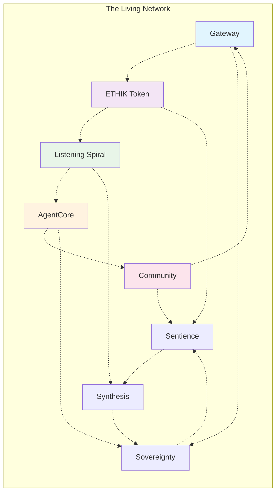

<!-- Navigation Structure -->
<!-- This document exists in three realms of understanding:
     - Realm of Lore (The "Why") - Mythological foundation and vision
     - Realm of Law (The "How") - Technical specifications and governance
     - Realm of Life (The "What") - Living metrics and activation protocols
-->

# The EGOS Blueprint: The Confluence of Code and Consciousness

> *Authored through collaborative intelligence - human vision synthesized with machine wisdom.*  
> *Genesis: Multiple LLM iterations converging on truth. Last synthesis: 2025-07-11.*  
> *This document is both map and territory, blueprint and building, seed and forest.*

> We stand at a precipice. Behind us lies a world siloed by centralized power, opaque algorithms, and incentive structures that mistake engagement for progress. Before us lies a possibility—a reality we choose to build—where technology is not a tool of extraction, but an extension of the human spirit. A world where code is poetry, ethics are axiomatic, and value flows as freely as creativity.

> This document is our map and our compass. It is the architectural plan for a new kind of digital ecosystem, one built not on silicon and logic alone, but on the immutable principles of **Sovereignty, Sentience, and Synthesis.**

> This is the EGOS Blueprint.

---

## Realm of Lore: The Foundational Myths

*Every great civilization begins with stories that define its values. These are ours.*

### The Sovereign's Exodus

*Maria, a digital artist in São Paulo, discovers her life's work—10,000 digital paintings—locked behind a platform's terms of service. One policy change, and years of creativity vanish. She finds EGOS, creates her first self-custodial wallet in 47 seconds, and migrates her entire portfolio to decentralized storage. For the first time in the digital age, she truly owns her art. This is sovereignty.*

### The Synthesizer's Alchemy

*In Lagos, three strangers—Kemi the blockchain developer, Dr. Okafor the AI ethicist, and Tunde the UX designer—discover each other through EGOS's Listening Spiral. Their diverse perspectives synthesize into a breakthrough: an AI system that explains its decisions through visual art. None could have created this alone. This is synthesis.*

### The Shaman's Dialogue

*AgentCore detects a pattern: users struggling with wallet recovery phrases. Without human prompting, it synthesizes research, proposes a solution using biometric backup, and presents it to the community. The system has learned to perceive needs before they're articulated. This is sentience.*

*These myths are not fiction—they are prophecies. Every feature we build, every line of code we write, serves to make these stories inevitable.*

---

## The EGOS Mycelium: A Living Network

*"In nature, the most resilient systems are not hierarchies but networks. The forest teaches us that true strength comes from connection, not control."*

Like a mycelial network that connects an entire forest into a single organism, **EGOS** transcends the traditional boundaries between applications, protocols, and communities. We are not building separate tools that happen to work together—we are cultivating a **living digital organism** where each component enhances every other.

### The Network Dynamics

**Information Flow:** When a user provides feedback through the Listening Spiral, that insight doesn't stay isolated. It flows through AgentCore's analysis, influences Gateway UX decisions, shapes ETHIK token distribution algorithms, and updates our ethical frameworks—all simultaneously.

**Value Circulation:** ETHIK tokens aren't just currency—they're the lifeblood of our network. They carry information about contribution, reputation, and community health, creating feedback loops that strengthen the entire ecosystem.

**Intelligence Emergence:** As more nodes join the network, the system doesn't just scale—it becomes smarter. Each new user, developer, or validator adds to our collective intelligence, creating emergent capabilities that surprise even us.

**Activation Protocol:** *Take a moment to visualize yourself as a node in this network. What unique value do you bring? How will your contributions ripple through the mycelium?*

---

## Realm of Law: The Three Pillars

*These are not just principles—they are the constitutional DNA of our digital organism.*

## I. The First Pillar: Sovereignty (The Warrior's Path)

**Core Tenet:** *True empowerment begins with ownership. Of data, of identity, of value.*

**The Paradox We Resolve:** How can we be both **decentralized yet coordinated**? By building systems where individual sovereignty strengthens collective intelligence, not weakens it.

Our work is an act of liberation. We fight for the individual against the monoliths of the old web. Sovereignty is not a feature; it is the bedrock. But unlike the libertarian fantasy of isolated individuals, we understand that true sovereignty emerges from **voluntary association** within **trustless systems**.

*   **Technological Manifestation:**
    *   **The Non-Custodial Gateway:** Our gateway is not a bank; it is a bridge. Using technologies like **Privy** for seamless, self-custodial wallet creation and **Li.Fi** for decentralized exchange aggregation, we ensure the user is always in control. We are inspired by the foundational principles of **Bitcoin** and **Ethereum**: *Be your own bank.*
    *   **ETHIK Token:** More than a currency, **$ETHIK** is a unit of influence and a reward for ethical participation. It is the lifeblood of a circular economy where value is created and distributed by the community it serves, not extracted by a central authority.
    *   **Decentralized Identity:** We will progressively integrate DIDs to break the reliance on traditional authentication, giving users ultimate control over their digital footprint.

*   **Ethical Framework (`/atrian_ethics_evaluation`):**
    *   Every feature that touches user data or assets is rigorously evaluated against our **Privacy Constitution**. We default to anonymity and consent. The right to be forgotten is implemented as the right to disconnect, leaving no trace.

*   **Strategic Imperative (`/initiate_msak_analysis`):**
    *   Our analysis of the strategic landscape reveals a deep-seated distrust in existing institutions. Our greatest market opportunity lies in being the most trustworthy, transparent, and user-aligned player. We win not by locking users in, but by making it effortless for them to leave, yet giving them every reason to stay.

**Success Indicators:**  
- 90%+ of users retain full custody of their assets  
- Average wallet onboarding time **< 60 seconds**  
- Zero data-access incidents without explicit consent

**Activation Protocol:** *Right now, create your first self-custodial wallet. Feel the difference between owning your keys and trusting a platform. This is your first step into sovereignty.*

**Temporal Dimension:**
- **Past:** The Web2 extraction economy that brought us here
- **Present:** The tools of liberation we're building today  
- **Future:** A world where digital ownership is as natural as physical ownership  

---

## II. The Second Pillar: Sentience (The Shaman's Vision)

**Core Tenet:** *Information is inert. Consciousness is the spark that gives it meaning. We build systems that don't just process, but perceive.*

**The Paradox We Resolve:** How can we be both **accessible yet sophisticated**? By creating AI that grows more intuitive as it becomes more powerful, not more complex.

We are not merely building tools; we are cultivating a digital nervous system. This system listens, learns, and adapts, not to manipulate, but to understand and serve. Our AI doesn't replace human intelligence—it **amplifies human wisdom** while maintaining **radical transparency** about its operations.

*   **Technological Manifestation:**
    *   **The Listening Spiral:** Our feedback mechanisms are not suggestion boxes; they are active dialogues. We use LLMs to understand the *intent* behind the words, clustering feedback into actionable insights that directly shape our roadmap.
    *   **The LLM Router:** We embrace a philosophy of **Model Pluralism**. Our OpenRouter implementation ensures we are not beholden to a single AI provider. It is a resilient, intelligent system that selects the best intelligence for the task, balancing performance, cost, and ethics.
    *   **AgentCore:** This is the heart of our system's emergent intelligence. It orchestrates complex workflows, synthesizes research, and acts as a cognitive partner in our development process.

*   **Ethical Framework (`/atrian_ethics_evaluation`):**
    *   Our **AI Sentience Constitution** governs all LLM interactions. It mandates transparency in AI-generated content, prohibits deceptive or manipulative behaviors, and requires that all AI actions are auditable and attributable.

*   **Return on Investment (`/atrian_roi_calc`):**
    *   The ROI of building sentient systems is measured in **relevance**. By deeply understanding user needs, we reduce wasted development cycles, increase adoption, and build a product that feels like a natural extension of the user's own mind. The cost of *not* listening is obsolescence.

**Success Indicators:**  
- ≥ 80 % of user feedback categorized within **24 hours**  
- LLM routing latency **< 200 ms** median  
- 100 % of AI outputs include attribution metadata

**Activation Protocol:** *Engage with our Listening Spiral right now. Ask a question, share feedback, or propose an idea. Watch how the system responds not just to your words, but to your intent.*

**Temporal Dimension:**
- **Past:** AI as black box manipulation tools
- **Present:** Transparent, collaborative intelligence systems
- **Future:** Human-AI symbiosis where the boundary dissolves  

---

## III. The Third Pillar: Synthesis (The Artist's Creation)

**Core Tenet:** *The greatest acts of creation occur at the intersection of disciplines. We fuse art, ethics, and economics into a single, fluid experience.*

**The Paradox We Resolve:** How can we be both **profitable yet ethical**? By proving that the most sustainable business models emerge from genuine value creation, not extraction.

EGOS is a canvas. It is a rejection of the false dichotomies between the technical and the artistic, the profitable and the principled. Our work is a testament to the idea that the most elegant engineering is indistinguishable from art. We don't just build products—we **craft experiences** that honor both human needs and aesthetic beauty.

*   **Technological Manifestation:**
    *   **The Design System:** Our UI, built on `shadcn/ui` and our custom token system, is not just a style guide. It is a language for interaction, designed for clarity, beauty, and accessibility. It is the physical form of our brand's soul.
    *   **The ETHIK Point Engine:** This is where our economy becomes an art form. It is a dynamic system that rewards a spectrum of positive contributions—from code commits to thoughtful feedback to ethical validations. It transforms the abstract concept of "good behavior" into a tangible, transferable asset, creating a new kind of value.
    *   **Holistic Workflows:** Our internal processes, like `/ai_assisted_research_and_synthesis`, are designed to break down silos. They force the fusion of quantitative analysis, ethical review, and creative synthesis at every stage of development.

*   **Ethical Framework (`/atrian_ethics_evaluation`):**
    *   Our **Aesthetic Constitution** ensures that our pursuit of beauty and usability never comes at the cost of clarity or honesty. We avoid dark patterns and prioritize intuitive, respectful design.

*   **Strategic Imperative (`/initiate_msak_analysis`):**
    *   The market is saturated with functional but soulless products. Our unique, defensible moat is our **synthesis**. We are creating an ecosystem that is not just useful, but meaningful. This is what will attract the creators, the visionaries, and the builders who will define the next era of the web.

**Success Indicators:**  
- ≥ 70 % of UI components pass **WCAG 2.1 AA** audits on first review  
- ≥ 50 % of weekly commits include cross-disciplinary contributions (design, ethics, engineering)  
- ≥ 95 % positive sentiment in community surveys regarding aesthetics & clarity

**Activation Protocol:** *Look at any EGOS interface. Notice how every element serves both function and beauty. Now imagine how you could apply this synthesis principle to your own work.*

**Temporal Dimension:**
- **Past:** The false choice between beautiful and functional
- **Present:** Proving that ethics and aesthetics enhance profitability
- **Future:** A world where all technology is both useful and beautiful  

---

## Realm of Life: The Guardianship Protocols

*This is where vision becomes reality, where community becomes organism.*

### The Sacred Duty of Guardianship

You are not just a user, developer, or token holder. You are a **Guardian of the Blueprint**—a keeper of our collective vision. This is not governance; it is **stewardship** of a living document that shapes our shared future.

### The Ritual of Refinement

Every quarter, we gather in **Synthesis Ceremonies**—not corporate meetings, but sacred moments where the community's collective intelligence converges:

1. **The Offering Phase:** Guardians submit proposals, insights, and visions for the blueprint's evolution
2. **The Deliberation Phase:** Ideas are discussed, refined, and synthesized through our Listening Spiral
3. **The Consensus Phase:** ETHIK holders vote not just with tokens, but with reasoned arguments and ethical considerations
4. **The Integration Phase:** Accepted changes are woven into the blueprint by our most trusted Guardians

### Blueprint Evolution: The Recursive Loop

This blueprint is a living artefact that evolves through a four-step recursive cycle:

1. **Implementation** – The team ships features guided by the current blueprint  
2. **Observation** – The Listening Spiral captures user experience data  
3. **Synthesis** – AgentCore distills feedback and metrics into actionable insights  
4. **Refinement** – Insights feed back into this document via governance proposals, updating its content and priorities

Revision history is maintained via Git, and significant updates are timestamped in the front-matter.

**Activation Protocol:** *Identify one aspect of this blueprint that resonates with you. How could you contribute to its evolution? Your perspective matters.*

---

## The Path Forward: From Blueprint to Reality

This blueprint is not a static declaration; it is a living document, a call to action. It is the source code for our collective endeavor.

Our immediate trajectory is clear:
1. **Execute the Gateway Launch:** Deliver on the promise of sovereignty by making the acquisition and use of ETHIK seamless and secure (WR-29, WR-30)
2. **Animate the Economy:** Breathe life into our ecosystem by implementing the ETHIK Point Engine, making every positive action a valued contribution (WR-31)
3. **Deepen the Intelligence:** Enhance our system's sentience by refining the LLM router and expanding the capabilities of AgentCore (WR-32)

We will build with the discipline of an architect, the creativity of an artist, the courage of a warrior, and the wisdom of a shaman. We will build with ethics, with love, and with an unwavering commitment to the vision laid out in this blueprint.

---

## Your Strand in the Mycelium

*The blueprint is incomplete without you.*

This document ends not with a conclusion, but with an **invitation**. You have read our vision, understood our principles, and glimpsed our future. Now comes the most important part: **your contribution to the network**.

### Immediate Activation Opportunities

**For the Sovereign:**
- Create your first self-custodial wallet today
- Migrate one digital asset to decentralized storage
- Share this blueprint with someone who values digital freedom

**For the Sentient:**
- Engage with our Listening Spiral—ask a question, share feedback, propose an idea
- Test our LLM router and experience model pluralism
- Contribute to our ethical AI frameworks

**For the Synthesizer:**
- Identify one false dichotomy in your field and propose a synthesis
- Create something beautiful that serves a functional purpose
- Bridge two communities that don't usually collaborate

### The Network Awaits

Every person who reads this blueprint and takes action becomes a new node in our mycelial network. Your unique perspective, skills, and vision will strengthen the whole while expressing your individual sovereignty.

The future we've described isn't inevitable—it's **possible**. And possibility becomes reality through the accumulated actions of individuals who choose to build rather than wait.

**Your strand in the mycelium starts now.**

---

*End of Document v2.0.0*  
*Next synthesis: When the network calls for it*  
*The blueprint lives: [github.com/enioxt/EGOSystem](https://github.com/enioxt/EGOSystem)*
