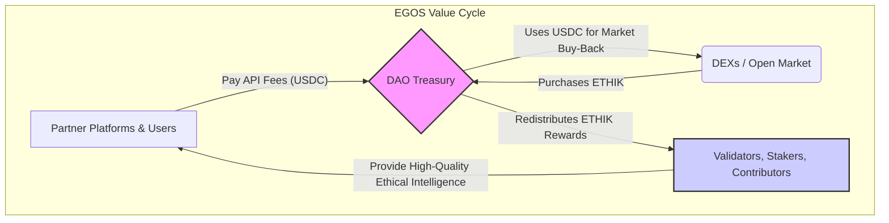

@references(level=0):
 - .windsurfrules
 - CODE_OF_CONDUCT.md
 - MQP.md
 - ROADMAP.md
 - CROSSREF_STANDARD.md

# 3. The ETHIK Token: A Sustainable Value Cycle

The economic engine of EGOS is designed for long-term sustainability, transparency, and direct alignment with the community. It is grounded in the reality of the existing ETHIK token and a clear, non-inflationary value proposition.

## 3.1 The Foundational Constraint: A Fixed, Existing Supply

Unlike projects with complex emission schedules, the ETHIK tokenomics begin with a simple and powerful fact: the token already exists with a fixed, immutable supply. There is no minting function, eliminating the risks of inflation and centralization of supply control.

-   **Token:** ETHIK
-   **Network:** Base
-   **Total Supply:** 1,000,000,000 (1 Billion)
-   **Contract Address:** [`0x633b346b85c4877ace4d47f7aa72c2a092136cb5`](https://basescan.org/token/0x633b346b85c4877ace4d47f7aa72c2a092136cb5)

This approach provides immediate transparency and aligns the DAO's incentives with those of every token holder from day one.

## 3.2 The "Buy-Back & Redistribution" Value Cycle

The core economic model is a virtuous cycle that directly links protocol revenue to participant rewards, creating sustainable demand for the ETHIK token.

1.  **Value Capture:** Partner platforms and direct users pay API fees in stablecoins (e.g., USDC) to access the Ethik Engine's intelligence, reducing their operational risks and costs.
2.  **Market Buy-Back:** The EGOS DAO Treasury automatically uses a significant portion of this revenue to purchase ETHIK tokens from the open market (e.g., via a Time-Weighted Average Price - TWAP strategy to minimize market impact).
3.  **Value Redistribution:** These purchased tokens are then redistributed to the active participants who create the value in the first place: validators, contributors, and stakers. A portion is also retained by the DAO treasury to fund future growth and operations.

This creates a clear and sustainable loop: as protocol usage grows, revenue increases, leading to more buy-backs and greater rewards for the community, which in turn incentivizes more high-quality participation.

## 3.3 The ETHIK Point System: Quantifying Contribution

While the ETHIK token represents on-chain value, the system's lifeblood is **Ethik Points**, an off-chain reputation score that quantifies each user's contribution. These points are the primary mechanism for determining a user's share of the redistributed ETHIK tokens.

Points are awarded for specific, value-adding actions within the Listening Spiral, such as providing verifiable evidence, mediating disputes, or being the first to signal a valid issue. The entire system is defined in a transparent, auditable document designed to prevent gaming and reward genuine contribution.

> For the complete, detailed breakdown of actions, rewards, and anti-gaming mechanisms, see the full **[[ETHIK Point Matrix|docs/tokenomics/ethik_point_matrix.md]]**.

## 3.4 The xETHIK Staking Wrapper: Utility and Governance

To provide direct utility and governance power to token holders, EGOS implements a staking wrapper contract.

-   **Staking:** Users can stake their ETHIK tokens to receive `xETHIK`, a non-transferable receipt token representing their share of the staking pool.
-   **Yield:** `xETHIK` holders receive a pro-rata share of the protocol's rewards, including a portion of the ETHIK bought back from the market and a percentage of the stablecoin fees collected.
-   **Governance:** `xETHIK` balance, often weighted by the duration of the stake (a "ve-curve" model), determines a user's voting power in the EGOS DAO. This ensures that the most committed, long-term participants have the greatest say in the protocol's future.

## 3.4 Liquidity and Risk Factors

-   **Liquidity Bootstrapping:** Initial liquidity for the ETHIK token on decentralized exchanges will be seeded by the DAO treasury, potentially supplemented by non-inflationary incentives for liquidity providers (e.g., rewarding them with NFTs that boost their validation rewards).
-   **Smart Contract Risk:** All contracts, especially the `xETHIK` wrapper and DAO treasury, will undergo rigorous independent security audits before deployment.
-   **Regulatory Clarity:** By utilizing an existing, fixed-supply token with no new issuance event and a value model based on market buy-backs, the model is designed to minimize regulatory ambiguity. However, a full legal memo will be commissioned to ensure compliance across key jurisdictions.

---
### Related Appendices
For advanced quantitative analysis of the buy-back velocity model, see **Appendix D – ETHIK Fixed-Supply Buy-Back Maths**. Risk scenarios that could impact token economics are listed in **Appendix C – Risks & Mitigations**.
